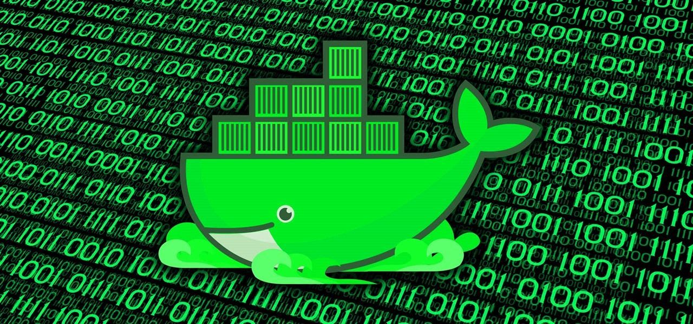

# dockmapper

A tool to facilitate nmap and reporting within a single docker container.

> **Note:** This is a work in progress. Use at your own risk. Only use to scan pre-approved environments...of course!

## macOS docker install

- `brew cask install docker`
- `brew install docker`

## Git clone the repo

- `git clone https://github.com/mrmario619/dockmapper.git`

## Docker image build

- `cd dockmapper`
- `docker build -t dockmapper .`

## Prepping for the scan

- Open a terminal session or a text editor
- Create a file within the `PWD` named `InputList`
- Add the desired `CIDR/IPRANGE/HOSTNAME` into the `InputList` as you would for a normal file input used in an NMAP scan
    - Example: `192.168.1.0/24`
    - Example: `192.168.1-254`
    - Example: `localhost`
    - Example: `host.localhost.local`
- Save the `InputList` file to your `PWD`

## Customizing the `entrypoint.sh`

The NMap scan parameters within the entry point bash script `entrypoint.sh` can be adjusted for different NMap scan types.

Below are a few examples to get started from.

- Medium rate SYN scan running agressive options (traceroute, OS detection, scripts) 
    - `-sS -T3 -A -oA`
- Faster rate SYN scan with a max-rtt-timeout set at 100ms and 3 maximum retries running ssl-cert analysis scripts against the "top 10" open ports
    - `-sS -T4 --max-rtt-timeout 100ms --max-retries 3 -top-ports 10 --open --script ssl-cert -oA`
- Ludicrous rate discovery only scan
    - `-sn -T5 -oA`

> **Rule#1:** The flags to be modified within the NMap scan parameters are between the string `${INPUT}` and the first match of the `${OUTPUT}` string.

> **Rule#2:** The `-oA` should always be the last flag statement, as it is required for the string that follows it.

> **Rule#3:** A docker image build will need to be run if the NMap scan script is modified!

## Docker run example

- `docker run -v $PWD:/root dockmapper:latest /root/InputList /root/OutputFile`

## After the scan completes

- After the scan completes an HTML output file will be created within the `PWD` with the name of `OutputFile.html`
- You can type `open OutputFile.html` on the terminal to have the report open in your default browser

## Looking to 2021

- automate build and push to dockerhub with "make"
- add additional NMap scan parameter granularity into `entrypoint.sh`
- test other version of underlying container flavor and nmap versions
- customize the xsl to enhance the report look, feel and features